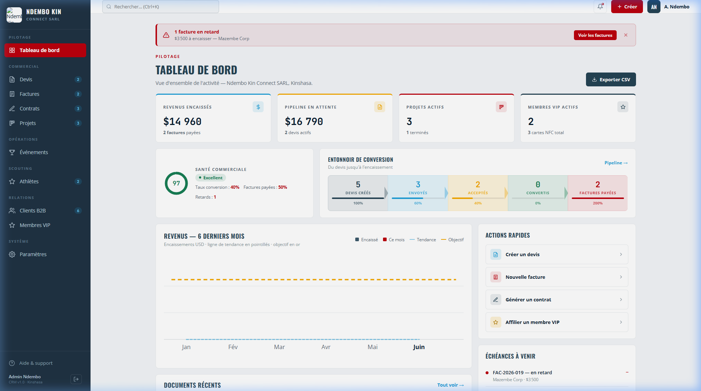
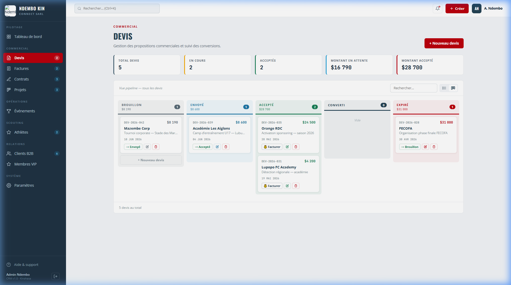
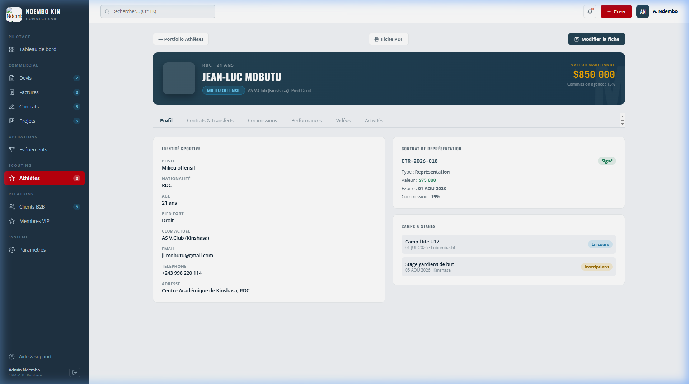

# Audit UX/UI et Évaluation Ergonomique : CRM Ndembokin

**Date :** 15 Juin 2026
**Cible :** `https://crm.ndembokin.com/`
**Rôle :** Utilisateur Final / Administrateur

## 1. Introduction et Méthodologie

Suite à votre demande, j'ai procédé à un audit approfondi du CRM Ndembokin en utilisant les identifiants fournis. L'objectif était d'évaluer le système d'un point de vue "utilisateur final", avec une attention particulière portée sur le design (UI), l'expérience utilisateur (UX), la navigation, et la cohérence visuelle. 

J'ai navigué à travers les différentes sections clés de l'application (Tableau de bord, Devis, Profils Athlètes, etc.) pour formuler cet avis critique et rigoureux.

---

## 2. Impression Générale et Identité Visuelle

**Avis global :** Le CRM présente une interface moderne, propre et professionnelle. Le choix d'une disposition classique "Sidebar à gauche + Contenu principal à droite" est une valeur sûre qui garantit une courbe d'apprentissage rapide pour les utilisateurs habitués aux outils B2B.

* **Charte Graphique :** L'utilisation du bleu nuit/gris foncé pour la barre latérale contraste bien avec le fond clair de la zone de travail. L'accentuation en rouge (boutons d'action principaux, alertes) est cohérente avec l'image de marque "Ndembo Kin" et guide efficacement le regard.
* **Typographie :** Les polices sans-serif utilisées sont lisibles, mais la hiérarchie visuelle pourrait parfois être accentuée dans les vues denses.

---

## 3. Analyse Critique par Section

### A. Le Tableau de Bord (Dashboard)

Le tableau de bord est le centre névralgique de l'application.

> [!NOTE] Points Forts
> - **Clarté des KPIs :** Les blocs supérieurs (Revenus, Pipeline, Projets, Membres) offrent une vision synthétique immédiate et très efficace.
> - **Entonnoir de conversion :** La représentation visuelle de l'entonnoir est une excellente idée pour suivre la santé commerciale.

> [!WARNING] Points d'Amélioration (Critique)
> - **Bandeau d'Alerte :** Le bandeau rouge d'alerte en haut ("1 facture en retard") est très visible, ce qui est bien. Cependant, le bouton "Voir les factures" en rouge foncé sur fond rouge clair manque légèrement de contraste.
> - **Lisibilité de l'Entonnoir :** Les textes sous les étapes de l'entonnoir ("Devis créés", "Envoyés") sont un peu petits par rapport à l'importance de ces données. Un léger ajustement de la taille de police améliorerait la lecture rapide.
> - **Graphique des Revenus :** S'il n'y a pas de données pour les mois précédents, la zone parait un peu vide. Un état "Zéro" plus explicite ou un message d'information pourrait rassurer l'utilisateur sur le bon fonctionnement du widget.

### B. Gestion Commerciale (Kanban des Devis)

L'affichage Kanban est indispensable pour le suivi des ventes.

> [!TIP] Points Forts
> - **Aperçu Financier :** Les encarts supérieurs résumant le total des devis, en cours, et acceptés sont parfaitement positionnés.
> - **Cartes Kanban :** Les informations clés (titre, date, montant, statut) sont bien hiérarchisées sur chaque carte. Les actions rapides (facturer, éditer, supprimer) directement sur la carte sont un gain de temps précieux.

> [!WARNING] Points d'Amélioration (Critique)
> - **Colonnes Vides :** La colonne "Converti" vide au milieu de colonnes pleines crée un déséquilibre visuel. Un "Empty State" (état vide) avec une illustration subtile et un message encourageant (ex: "Aucun devis converti récemment. Relancez vos prospects !") rendrait l'interface plus vivante.
> - **Badges de Statut :** Les couleurs des badges d'état (Brouillon, Envoyé, Accepté) sont un peu trop subtiles (pastel). Accentuer légèrement la saturation des couleurs permettrait de repérer plus vite l'état d'un devis au premier coup d'œil.

### C. Profil Athlète (Scouting)

Section cruciale pour un CRM orienté sport.

> [!NOTE] Points Forts
> - **Header Immersif :** L'en-tête sombre avec la "Valeur Marchande" mise en évidence en jaune est du plus bel effet. Cela donne un aspect "Premium" et met instantanément en avant la donnée la plus critique.
> - **Navigation par Onglets :** Très bonne organisation pour éviter de surcharger la page d'informations.

> [!CAUTION] Points d'Amélioration (Critique)
> - **Zone "Identité Sportive" :** Bien que propre, cette zone est un peu dense en texte. Pour faciliter la lecture (scan visuel), il serait judicieux de :
>   - Ajouter de subtils filets de séparation (bordures grises très claires) entre chaque ligne (Poste, Nationalité, Âge...).
>   - Augmenter très légèrement l'espacement (padding/margin) vertical entre les éléments.
> - **Contrôles des Onglets :** Sur la droite des onglets ("Profil", "Contrats...", etc.), des flèches de défilement horizontal sont visibles alors que l'écran semble assez large pour tout afficher. Si tous les onglets rentrent, ces flèches ne devraient pas apparaitre pour ne pas induire l'utilisateur en erreur.

---

## 4. Recommandations Générales

Pour faire passer l'expérience utilisateur de "très bonne" à "excellente" (niveau Premium), voici mes recommandations principales :

1. **Micro-interactions et Feedbacks :** 
   - Assurez-vous que chaque action de l'utilisateur (clic sur un bouton, survol d'une ligne dans un tableau, déplacement d'une carte Kanban) soit accompagnée d'un retour visuel immédiat (changement de couleur au `:hover`, petite animation de chargement, notification "Toast" de succès).
   - Les transitions de pages semblent nettes, mais de légères animations (fondus, glissements) entre les écrans pourraient renforcer l'aspect application moderne "Single Page Application".

2. **Accessibilité (A11y) et Contrastes :**
   - Révisez certains contrastes de couleurs, notamment sur les textes gris clair sur fond blanc et les boutons secondaires. Utilisez un outil de vérification de contraste (norme WCAG) pour vous assurer que l'interface est lisible sans effort par tous.

3. **Gestion des "Empty States" :**
   - Ne laissez jamais un espace blanc sans explication. Si un tableau est vide, si un Kanban n'a pas de carte, ou si un graphique n'a pas de données, insérez systématiquement une petite illustration soignée et un message textuel guidant l'utilisateur sur la marche à suivre (ex: "Commencez par ajouter votre premier client ici").

4. **Personnalisation :**
   - Étant donné le thème sombre de la barre latérale, proposer un "Dark Mode" complet pour l'ensemble de l'interface serait un ajout très apprécié par les utilisateurs qui passent de longues heures sur l'outil.

## Conclusion

Le CRM Ndembokin est un outil **solide, bien structuré et visuellement agréable**. L'architecture de l'information est logique, ce qui rend l'outil intuitif. Les critiques soulevées ci-dessus relèvent du "polish" (finitions) : ce sont des détails ergonomiques et visuels qui, une fois corrigés, permettront d'offrir une expérience utilisateur véritablement haut de gamme et sans friction.
